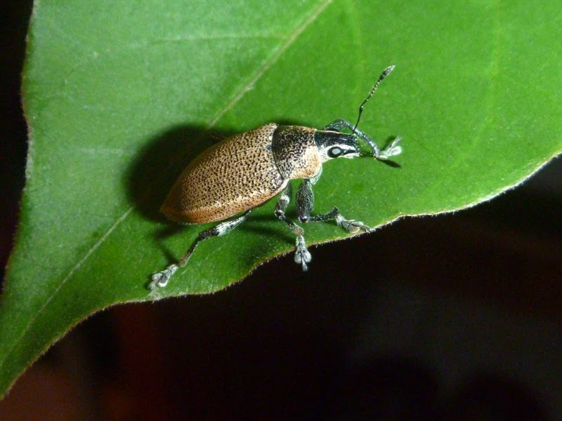

## Research Associate

 

**Research area**: Detecting species interactions and forest food webs

**Contact email**: James.Kitson@ncl.ac.uk

**Info**: My work focuses on developing and using molecular tools for the detection of species interactions such as parasitism, predation or pollination. The aim is to generate well sampled ecological networks that can be used as a tool to predict the future effects of changing environmental pressures such climate change, invasive species or habitat loss on ecosystems.

**R**: My research is primarily a mixture of laboratory and field research but ultimately all my data gets analysed in R (and a bit of Python). I've used R for everything from plotting high quality figures and linear modelling through to processing sequencing data, phylogenetics and biogeographic analyses.

To find out more, check out my [university webpage](https://www.ncl.ac.uk/nes/staff/profile/jameskitson.html#background) or [google scholar](https://scholar.google.co.uk/citations?user=qOgUVEQAAAAJ&hl=en) page.  
  

***

